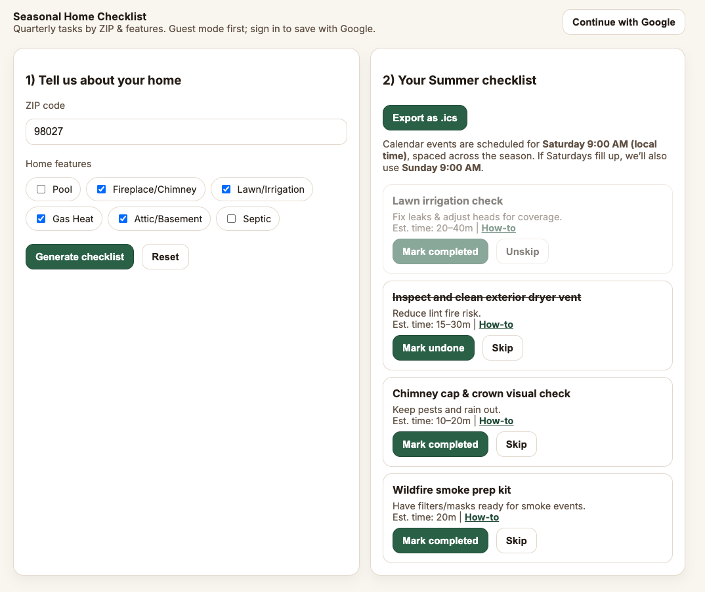

# Seasonal Home Checklist

A simple, location-aware seasonal home maintenance checklist for single-family homeowners.  
Enter your ZIP and home features, and get a personalized set of quarterly tasks — ready to export to your calendar.

## Why I Built This

Owning a home means juggling dozens of recurring tasks each year:  
cleaning gutters, swapping filters, servicing systems, and preparing for seasonal weather.  
Most people keep this info scattered in notes, blogs, or memory — and things slip through the cracks.  

This project solves that with:
- A personalized checklist that adapts to your climate and home features.
- A quick Google sign-in to save your info and sync across devices.
- Calendar export so your reminders show up automatically.

## How It Works

1. **Enter your ZIP code** — We match it to a climate profile.
2. **Select your home features** — Pool, fireplace, lawn irrigation, etc.
3. **Generate checklist** — You’ll get 12–25 tasks for the season, spaced across Saturdays at 9:00 AM local time (and Sundays if needed).
4. **Export as `.ics`** — Import into Google, Apple, or Outlook calendars.

You can mark tasks completed or skipped, and your preferences are remembered locally (or across devices if signed in).

## Tech Stack

- **Frontend:** Next.js + Tailwind CSS
- **Backend / DB:** Supabase (Postgres + Auth with Google)
- **Auth:** Google OAuth
- **Hosting:** Render
- **Persistence:** LocalStorage for guests, Supabase for signed-in users

## What’s Next

- Nicer header design (currently using plain text — see `/docs/todo.md`)
- Affiliate/referral integration for “Hire it out” links
- More detailed task library and how-to resources
- Polished mobile experience

## Live Demo

You can try the app here:  
[https://homemaintenancechecklist.onrender.com](https://homemaintenancechecklist.onrender.com)

---

*Built as a portfolio project to demonstrate product thinking, design iteration, and full-stack execution.*
